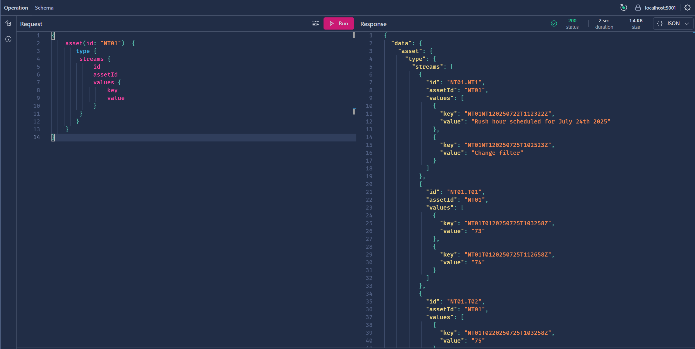

# RocksDB Spike

This repository contains experiments and examples of working with RocksDB in C#.

## Examples

There are some ad-hoc examples, exploring different aspects of the RocksDB usage.

- FamilyTree is a simple program showing Put/Get/Iterator methods.
    - For the same example in Python, check Jupyter [notebook](./simple_family_tree.ipynb).
- ColumnFamily is to explore how to use column families functionality.
- PrefixIterator is to show how to use prefix iterators.

## Projects

Projects as more extensive example of usage of RocksDB simulating real application.

### Modest Blackwell API

A .NET Core 9.0 Web API that provides access to automation equipment data in a house. The API uses YAML files for metadata and uses RocksDB for time-series data storage. The project was generated using Copilot Agent, with some manual corrections. You can check the [Copilot instructions here](./modest-blackwell/.copilot/Instructions/copilot-instructions.md).

#### Features

- **Assets Management**: CRUD operations for automation assets (thermostats, lights, etc.)
- **Data Streams Management**: Access to sensor and equipment measurement definitions
- **RESTful API**: Clean REST endpoints with comprehensive documentation
- **Swagger Integration**: Interactive API documentation available at the root URL

#### Technology Stack

- **.NET Core 9.0** - Web API framework
- **YamlDotNet** - YAML file parsing
- **RocksDbSharp** - RocksDB C# wrapper (for future time-series data)
- **Swagger/OpenAPI** - API documentation

#### Getting Started

1. **Prerequisites**:
   ```bash
   # Install libsnappy (required for RocksDB on Linux)
   sudo apt update && sudo apt install -y libsnappy-dev
   ```

2. **Build and Run**:
   ```bash
   cd modest-blackwell
   dotnet build
   dotnet run
   ```

3. **Access the API**:
   - API Base URL: `http://localhost:8080`
   - Swagger Documentation: `http://localhost:8080` (root URL)
   - GraphQL Console: `http://localhost:8080/graphql`

#### API Endpoints

**Assets**:
- `GET /api/assets` - Get all assets
- `GET /api/assets/{id}` - Get asset by ID

**Data Streams**:
- `GET /api/streams` - Get all data streams
- `GET /api/streams/{id}` - Get data stream by ID
- `GET /api/streams/by-asset/{assetId}` - Get all streams for a specific asset

#### Data Structure

The API reads from YAML files located in `data/yaml/`:

- **assets.yaml**: Contains asset metadata (thermostats, lights, etc.)
- **streams.yaml**: Contains data stream definitions (temperature readings, status indicators, etc.)

#### Example Usage

```bash
# Get all assets
curl -s http://localhost:8080/api/assets | jq .

# Get a specific asset
curl -s http://localhost:8080/api/assets/NT01 | jq .

# Get all data streams
curl -s http://localhost:8080/api/streams | jq .
```

### GraphQL queries

Example of query using GraphQL:

```GraphQL
{
    asset(id: "NT01")  {
       type {
        name
        streams {
            id
            assetId
            values {
                key
                value
            }
        }
       }
    }
}
```



### Operational Data

The intent of the program `OperationalData` is to seed the RocksDB with operational data. Use the [Excel spreadsheet](./modest-blackwell/OperationalData/load/Operational_poc_data.xlsx) to help generating the lines and paste on [load file](./modest-blackwell/OperationalData/load/alarm-data-load.txt).

```bash
dotnet run [--seed]
```

Use 'seed', '--seed', or '-s' argument to seed sample data.

## Development Environment

This project uses a dev container with:
- .NET Core 9.0 SDK
- Python support
- libsnappy-dev (for RocksDB compression)
- C# dev tools and extensions
