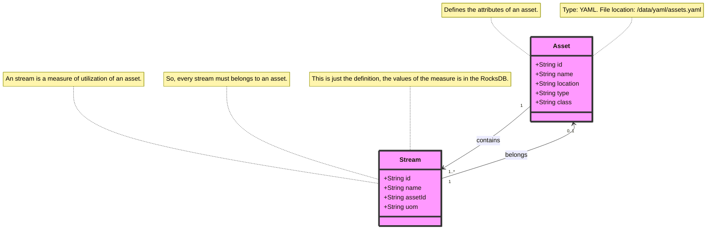

```mermaid
classDiagram
direction TB
    class Asset {
        +String id
	    +String name
	    +String location
        +String type
        +String class
    }

    class Stream {
	    +String id
	    +String name
	    +String assetId
        +String uom
    }

	note for Asset "Defines the attributes of an asset."
    note for Asset "Type: YAML. File location: <project folder>/data/yaml/assets.yaml"
	note for Stream "An stream is a measure of utilization of an asset."
    note for Stream "So, every stream must belongs to an asset." 
    note for Stream "This is just the definition, the values of the measure is in the RocksDB."

    Asset "1" --> "1..*" Stream : contains
    Stream "1" --> "0..1" Asset : belongs

	style Asset fill:#f9f,stroke:#333,stroke-width:4px
	style Stream fill:#f9f,stroke:#333,stroke-width:4px

	class Asset:::assetStyle
	class Stream:::streamStyle
```