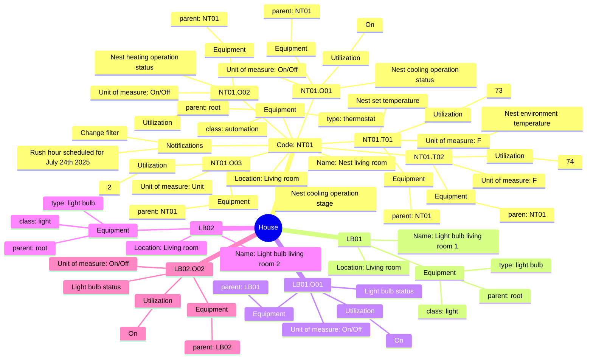

Data Structure
- Asset code
    - Name
    - Location
    - Equipment
        - type
        - class
        - parent
    - Unit of measure
    - Status
    - Operation parameters
        - Notifications
        - Utilization
        - Alarm

## Examples

- NT01
    - Name: Nest living room 
    - Location: Living room
    - Equipment
        - type: thermostat
        - class: automation
        - parent: root
    - Notifications
        - Change filter
        - Rush hour scheduled for July 24th 2025

- NT01.T01
    - Nest set temperature
    - Equipment
        - parent: NT01
    - Unit of measure: F
    - Utilization
        - NT01T0120250725T154322Z: 73
        - NT01T0120250725T184322Z: 74

- NT01.T02
    - Nest environment temperature
    - Equipment
        - paren: NT01
    - Unit of measure: F
    - Utilization
        - NT01T0220250725T154322Z: 75
        - NT01T0220250725T164322Z: 74
        - NT01T0220250725T174322Z: 73
        - NT01T0220250725T184322Z: 74

- NT01.O01
    - Nest cooling operation status 
    - Equipment
        - parent: NT01
    - Unit of measure: On/Off
    - Utilization
        - On

- NT01.O02
    - Nest heating operation status 
    - Equipment
        - parent: NT01
    - Unit of measure: On/Off
    - Utilization
        - Off

- NT01.O03
    - Nest cooling operation stage 
    - Equipment
        - parent: NT01
    - Unit of measure: Unit
    - Utilization
        - 2

- LB01
    - Name: Light bulb living room 1 
    - Location: Living room
    - Equipment
        - type: light bulb
        - class: light
        - parent: root

- LB01.O01
    - Light bulb status
    - Equipment
        - parent: LB01
    - Unit of measure: On/Off
    - Utilization
        - On

- LB02
    - Name: Light bulb living room 2 
    - Location: Living room
    - Equipment
        - type: light bulb
        - class: light
        - parent: root

- LB02.O02
    - Light bulb status
    - Equipment
        - parent: LB02
    - Unit of measure: On/Off
    - Utilization
        - On